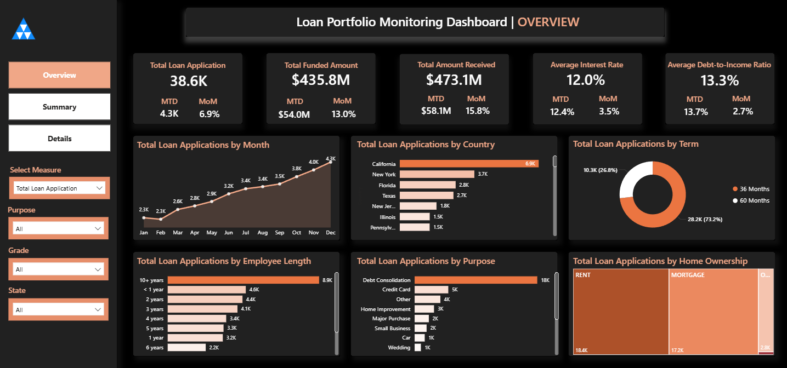
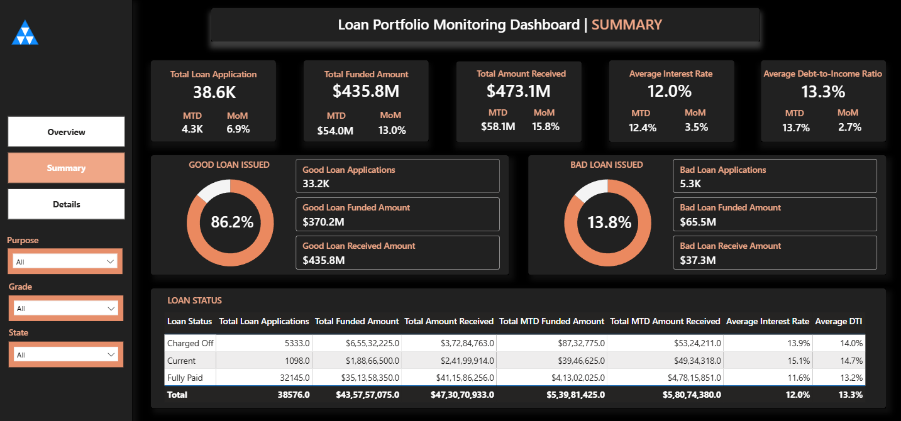
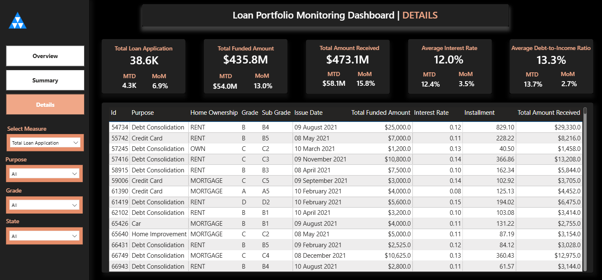
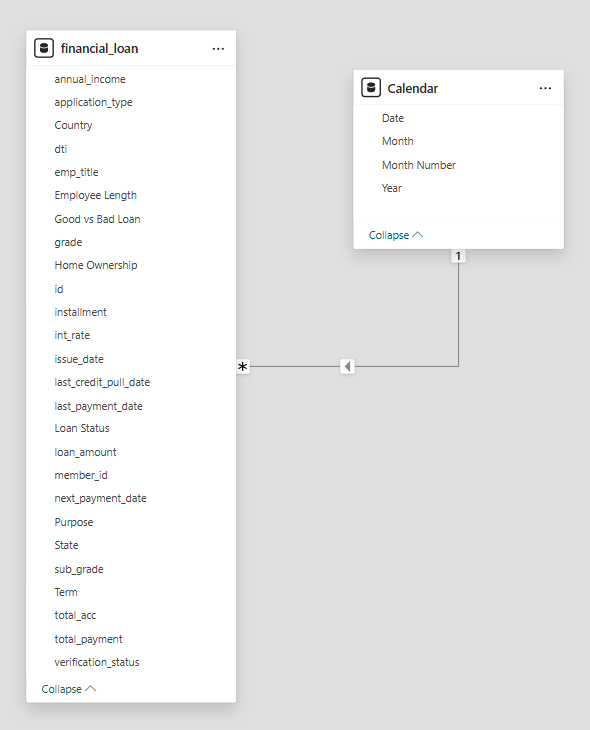

# 🏦 Loan Portfolio Monitoring Dashboard | Power BI
An interactive end-to-end Power BI dashboard designed to analyze loan applications, funding performance, repayment trends, and credit risk indicators.
This project transforms raw banking data into decision-ready insights using dynamic KPIs, segmentation logic, and drill-down analysis.

## 📸 Dashboard Preview

---

---

---
## 📸 Data Model

## 📌 Problem Statement

Banks need clear visibility into:
- Loan performance
- Risk exposure
- Good vs Bad loan distribution
- Monthly growth trends
- Interest rate & DTI behavior

This dashboard helps stakeholders monitor lending health, repayment patterns, and borrower risk metrics in real-time.

---

## 📊 Dashboard Overview

The report consists of three main pages:

### 1️⃣ Overview Page
- Total Loan Applications: **38.6K**
- Total Funded Amount: **$435.8M**
- Total Amount Received: **$473.1M**
- Avg Interest Rate: **12.0%**
- Avg DTI: **13.3%**
- MTD & MoM growth tracking
- Loan Applications by:
  - Month (trend analysis)
  - State
  - Term (36 vs 60 months)
  - Employment Length
  - Purpose
  - Home Ownership

---

### 2️⃣ Summary Page (Risk Segmentation)

#### ✅ Good Loans (86.2%)
- 33.2K Applications
- $370.2M Funded
- $435.8M Received

#### ❌ Bad Loans (13.8%)
- 5.3K Applications
- $65.5M Funded
- $37.3M Received

Loan status breakdown:
- Charged Off
- Current
- Fully Paid

---

### 3️⃣ Details Page

Granular loan-level dataset including:
- Loan ID
- Purpose
- Home Ownership
- Grade & Subgrade
- Issue Date
- Funded Amount
- Installment
- Interest Rate
- Total Amount Received

Enables drill-through level credit and risk analysis.

---

## ⚙️ Tech Stack

- Power BI
- Power Query (Data Cleaning & Transformation)
- DAX (Calculated Measures & KPIs)
- Data Modeling

---

## 📈 Key Features

✔ Dynamic KPI Cards with MTD & MoM growth  
✔ Good vs Bad Loan Classification Logic  
✔ Loan Status Risk Breakdown  
✔ Trend Analysis (Monthly Applications)  
✔ Interest Rate & DTI Monitoring  
✔ Interactive Filters (Purpose, Grade, State, Home Ownership)  
✔ Drill-down capability to loan-level details  

---

## 📊 Key DAX Measures Implemented

- Total Loan Applications
- Total Funded Amount
- Total Amount Received
- MTD Funded Amount
- MoM Growth %
- Average Interest Rate
- Average DTI
- Good Loan %
- Bad Loan %
- Risk Segmentation Logic

---

## 💡 Business Insights Generated

- 86.2% of loans are performing (Good Loans)
- 13.8% fall under risk/charged-off category
- 60-month loans dominate portfolio distribution
- Debt Consolidation is the highest loan purpose
- Rent & Mortgage borrowers represent majority segments
- Steady month-over-month growth observed in loan applications

---

## 🧠 Skills Demonstrated

- KPI Development & Financial Metrics Design
- Risk Segmentation & Credit Analysis
- DAX Optimization
- Data Storytelling
- Dashboard UI/UX Structuring
- Banking Domain Understanding

---

## 🚀 How to Use

1. Download the `.pbix` file
2. Open in Power BI Desktop
3. Use slicers to filter by State, Purpose, Grade, etc.
4. Navigate between Overview, Summary, and Details pages

---

## 📬 Connect With Me

If you're a recruiter or hiring manager looking for a Data Analyst with strong Power BI & business analytics skills, feel free to connect.

